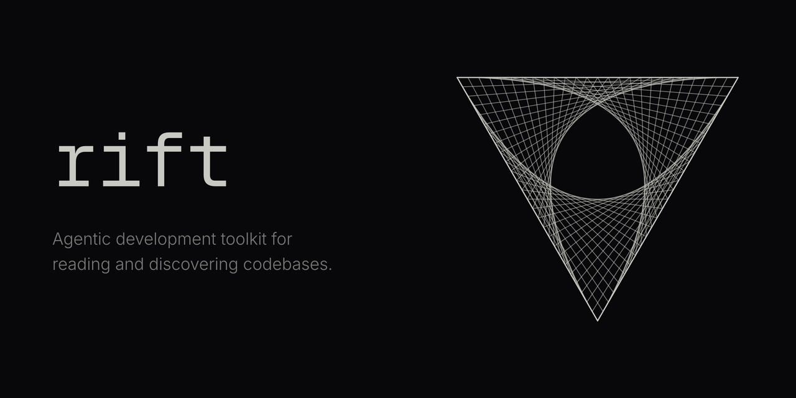

# Rift

[](https://volar.sh/rift/)

Rift is an agentic development toolkit for reading, discovering, and editing codebases.

Rift provides contextual, parser-precise codebase reading and editing tools. It combines syntax,
semantic analysis, and history to give agents the best available context. Through MCP, agents read
declarations and provider facts, then precisely edit symbols with a clear blast radius. Changes can
be staged in filesystem projections, inspected, and published into the workspace.

📖 [Read the documentation](https://volar.sh/rift/docs/draft/)

## Protocol development

The protocol and `rift.toml` models live in `protocol/src/rift/models`. Generate their JSON Schema
and Protobuf outputs with:

```sh
cd protocol
uv run python -m rift.generate --check
```

## Rust development

Rust uses toolchain pinned by `rust-toolchain.toml`. Install `uv`, `just`, `cargo-audit`,
`cargo-deny`, and `cargo-llvm-cov`, then run same gates as CI from repository root:

| Command | Gate |
| --- | --- |
| `just format` | Rust formatting |
| `just generate-check` | Generated protocol drift |
| `just check` | All targets, features, crate edges, and binary ownership |
| `just test` | Workspace tests |
| `just clippy` | Strict Clippy policy |
| `just docs` | Warning-free Rust documentation |
| `just audit` | Advisory, license, ban, and source policy |
| `just coverage` | CLI coverage report and hard 86% line floor |
| `just rust-gate` | Every gate above |

GitHub Actions runs each target separately so failed gate remains visible by name.

Install pre-commit hook with `uvx pre-commit install`. It runs `just rust-gate`, including same
coverage and Cargo policy checks enforced by CI.
